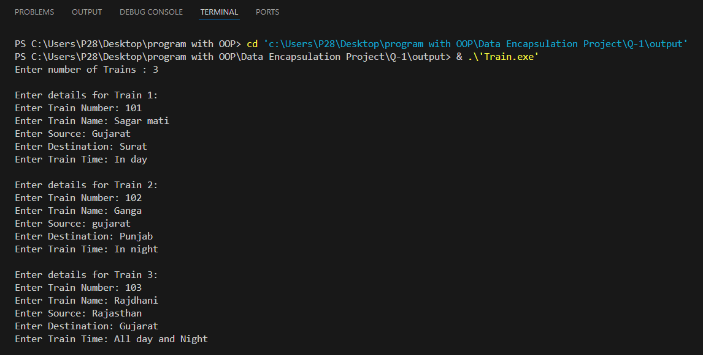
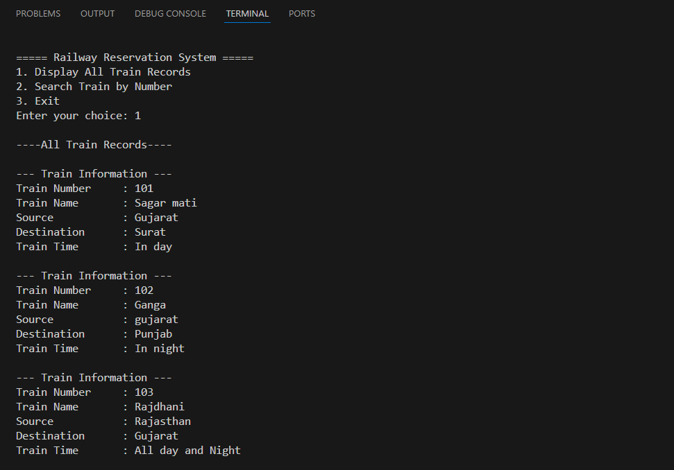
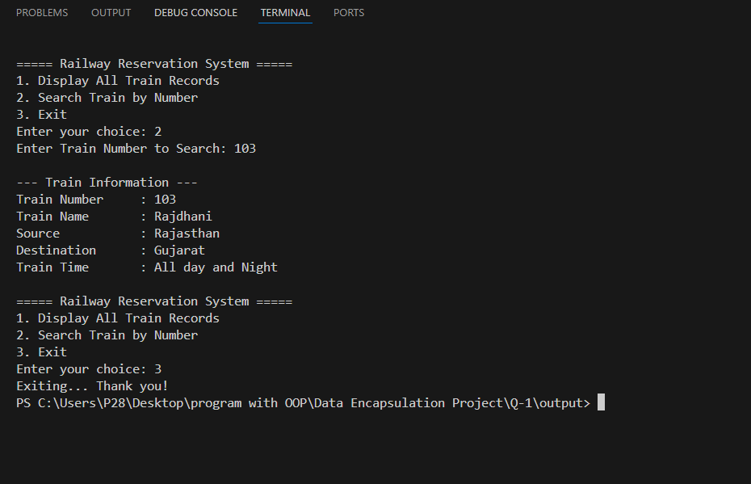

# Railway Reservation System

## Project Overview
This is a simple **Railway Reservation System** project in C++ demonstrating **data encapsulation** using classes.  
The project allows users to:

- Store train information
- Display all train records
- Search for a train by its number

---

## Project Features
1. **Add Train Records** – input details for multiple trains  
2. **Display All Train Records** – view all train details  
3. **Search Train by Number** – find a specific train quickly  
4. **Encapsulation** – class members are private and accessed via public methods

---

## Project Structure

### Class `Train`
**Private Members:**
- `train_no`
- `train_name`
- `source`
- `destination`
- `train_time`

**Public Methods:**
- `setData()` – input train details  
- `getData()` – display train details  
- `getTrainNo()` – get train number for searching  

---

## Screenshots

### 1. Program Running


### 2. Menu Options


### 3. Optional Class Diagram


> **Note:** Store your images in a folder named `images` in the same directory as your `README.md`.

---

## How to Run
1. Compile the program:
   ```bash
   g++ main.cpp -o RailwayReservation
