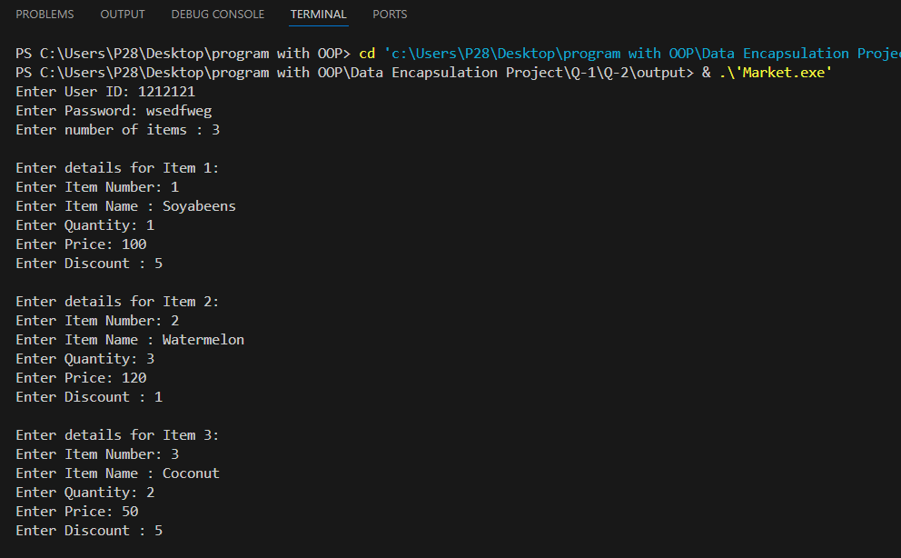
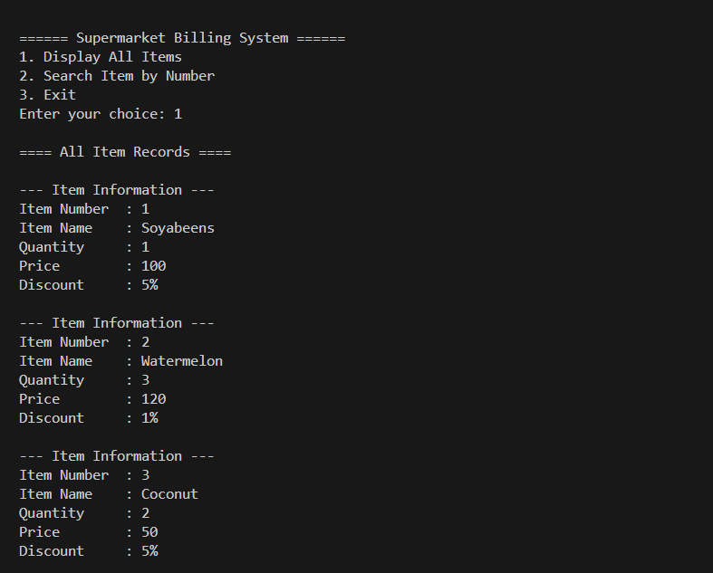
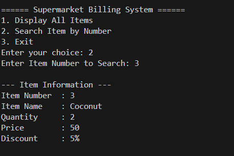
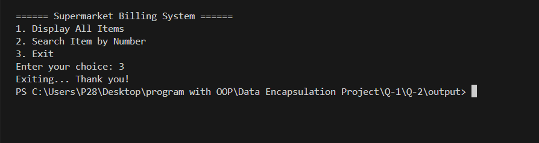

# Supermarket Billing System

## Project Overview
This is a simple **Supermarket Billing System** project in C++ demonstrating **data encapsulation** using classes.  
The system allows users to:

- Store item information
- Display all item records
- Search for an item by its number

---

## Project Features
1. **Add Item Records** – input details for multiple items  
2. **Display All Items** – view all items in a formatted manner  
3. **Search Item by Number** – find a specific item quickly  
4. **Encapsulation** – class members are private and accessed via public methods

---

## Project Structure

### Class `Market`
**Private Members:**
- `item_no` : Item number
- `item_name` : Name of the item
- `quantity` : Quantity available
- `price` : Price per unit
- `discount` : Discount on the item (%)

**Public Methods:**
- `setData()` – input item details  
- `getData()` – display item details  
- `getItemNo()` – get item number for searching  

---

## Screenshots

### 1. Program Running


### 2. Menu Options


### 3. Optional Class Diagram



> **Note:** Store your images in a folder named `images` in the same directory as your `README.md`.

---

## How to Run
1. Compile the program:
   ```bash
   g++ main.cpp -o SupermarketBilling
